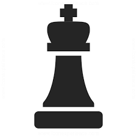

The Young Chess Learners Guide
========================================================
author: Adam Jordan
date: November 7, 2016
autosize: true

The Problem
========================================================

Chess is a difficult game of pure strategy; where any luck comes from
your opponent doing poorly. However, most people do not learn the simple
game so that they can compete in complex mental warfare. The point of my
app is to familiarize people with those simple movements the pieces can
make. There are other unique moves that are necessary for certain
strategies or survivability. These are also included in my app.

Theoretically, if a more advanced program needed to be created for teaching
strategy or testing one's skill level, this app would make for a good 
intro to chess as a whole to that program.




Slide With Code
========================================================


```r
summary(cars)
```

```
     speed           dist       
 Min.   : 4.0   Min.   :  2.00  
 1st Qu.:12.0   1st Qu.: 26.00  
 Median :15.0   Median : 36.00  
 Mean   :15.4   Mean   : 42.98  
 3rd Qu.:19.0   3rd Qu.: 56.00  
 Max.   :25.0   Max.   :120.00  
```

Slide With Plot
========================================================


